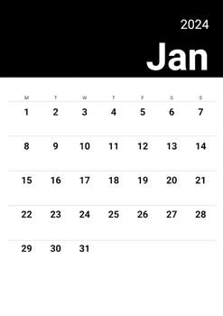

# Auto Calendar

Welcome to Auto Calendar, a Python script that utilizes the Blender bpy library to create a calendar based on data it retrieves, such as the year, fonts, colors, etc., present in a JSON file.  
The script generates a PDF file with all the months, in A3 format.
This way, you get a beautiful up-to-date calendar by simply changing the year, and that for all the upcoming years ✨😊

## 📕 Table of Contents
- [Auto Calendar](#auto-calendar)
  - [📕 Table of Contents](#-table-of-contents)
  - [Prerequisites](#prerequisites)
  - [🧰 Instalation](#-instalation)
    - [macOs, linux](#macos-linux)
    - [windows](#windows)
  - [🕹️ Usage](#️-usage)
    - [Preview](#preview)


## Prerequisites
Before using Auto Calendar, make sure you have the following installed on your system:

- Python (version 3.11.4 ou supérieure) [link to Python installation](https://www.python.org/downloads/)
- Blender (version 4.0 ou supérieure) [link to Blender installation](https://www.blender.org/download/)


## 🧰 Instalation

### macOs, linux
Open a terminal

1. Clone this repository to your machine:
   ````bash
   git clone https://github.com/LudoTreb/auto_calendar.git

    ````

2. Navigate to the project directory:
   ````bash
   cd auto_calendar

    ```` 
3. Create and activate a virtual environment:
    ````bash
    python -m venv venv
    source venv/bin/activate
    ```` 
4. Install the necessary dependencies using the requirements.txt file:
    ````bash
    pip install -r requirements.txt
    ````
5. ⚠️ Path to Blender application ⚠️
Once Blender is installed, you need to define the path to where the Blender application executable is located in the data.json file.
For example, on my system, the Blender executable is here:  
        ```
        /Applications/Blender.app/Contents/MacOS/Blender  
        ```  
    and I put it in the data.json file like this:   
    ```json
    "blender": {
        "application_path": "/Applications/Blender.app/Contents/MacOS/Blender"
      }
    ```   
    

### windows

1. Clone this repository to your machine using Git Bash:
   ````bash
   git clone https://github.com/LudoTreb/auto_calendar.git

    ````

2. Navigate to the project directory:
   ````bash
   cd auto_calendar

    ```` 
3. Create and activate a virtual environment:
    ````bash
    python -m venv venv
    venv\Scripts\activate
    ```` 
4. Install the necessary dependencies using the requirements.txt file:
    ````bash
    pip install -r requirements.txt
    ````
5. ⚠️ Path to Blender application ⚠️
Once Blender is installed, you need to define the path to where the Blender application executable is located in the data.json file. To avoid problems, use a double \ to define the path. 
For example:  
        ```
        "C:\\Users\\apps\\blender\\current\\blender.exe"
        ```  
    and I put it in the data.json file like this:   
    ```json
    "blender": {
        "application_path": "C:\\Users\\apps\\blender\\current\\blender.exe"
      }
    ```  

## 🕹️ Usage
Open a terminal

1. Make sure you are in the root directory of the project and your virtual environment is activate:

```bash
cd /path/to/folder/auto_calendar

source venv/bin/activate # on macos linux

venv\Scripts\activate # on windows

```
   
2. Run the main script main.py to generate the calendar:
```bash
python main.py
```

3. Retrieve the calendar in PDF format from the 'export_pdf' folder and there you go ✨

### Preview


 

When the next year comes, you just have to change the year in the data.json file and rerun the script to get an up-to-date calendar 🎉

